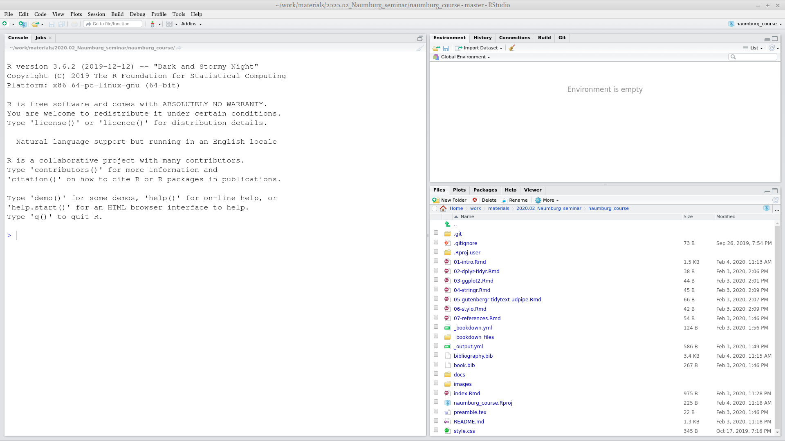

# Introduction to R and RStudio {#intro}

## Introduction
### Why data science?
Data science is a new field that actively developing lately. This field merges computer science, math, statistics, and it is hard to say how much science in data science. In many scientific fields a new data science paradigm arises and even forms a new sub-field:

* Bioinformatics
* Crime data analysis
* Digital humanities
* Data journalism
* Data driven medicine
* ...

There are a lot of new books "Data Science for ...":

* psychologists [@hansjoerg19]
* immunologists [@thomas19]
* business [@provost13]
* public policy [@brooks13]
* fraud detection [@baesens15]
* ...

Data scientist need to be able:

* gather data
* transform data
* visualize data
* create a statistical model based on data
* share and represent the results of this work
* organize the whole workflow in the reproducible way

### Why R?

R [@r19] is a programing language with a big infrastructure of packages that helps to work in different fields of science and computer technology.

There are several alternatives:

* Python [@vanderplas16; @grus19]
* bash [@janssens14]
* java [@brzustowicz17]
* ...

## Introduction to RStudio
R is the programming language. RStudio is the most popular IDE (Integrated Development Environment) for R language.

When you open RStudio for the first time you can see something like this:

When you press  button at the top of the left window you will be able to see all four panels of the RStudio.

## R as a calculator

## Functions

## Variables

## Variable types

## Vector

### Vector coercion

### Vector operations

### Vector recycling

### Indexing vectors

### `NA` value

## Dataframe (tibble)

### Indexing dataframes

## Packages

## Data import
### `.csv` files
### `.xls` and `.xlsx` files

## Rmarkdown

