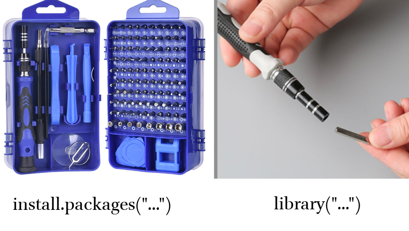

# Introduction to R and RStudio {#intro}

## Introduction
### Why data science?
Data science is a new field that is actively developing lately. This field merges computer science, maths, statistics, and it is hard to say how much science in data science. In many scientific fields a new data science paradigm arises and even forms a new sub-field:

* Bioinformatics
* Crime data analysis
* Digital humanities
* Data journalism
* Data driven medicine
* ...

There are a lot of new books "Data Science for ...":

* psychologists [@hansjoerg19]
* immunologists [@thomas19]
* business [@provost13]
* public policy [@brooks13]
* fraud detection [@baesens15]
* ...

Data scientist need to be able to:

* gather data
* transform data
* visualize data
* create a statistical model based on data
* share and represent the results of this work
* organize the whole workflow in a reproducible way

### Why R?

R [@r19] is a programming language with a big infrastructure of packages that helps to work in different fields of science and computer technology.

There are several alternatives:

* Python [@vanderplas16; @grus19]
* Julia [@bezanson17]
* bash [@janssens14]
* java [@brzustowicz17]
* ...

You can find some R answers here:

* R for data science [@wickham16], it is online
* [R community](https://community.rstudio.com/)
* [stackoverflow](https://stackoverflow.com)
* any search engine you use
* ...

## Introduction to RStudio
R is the programming language. RStudio is the most popular IDE (Integrated Development Environment) for R language.

When you open RStudio for the first time you can see something like this:


When you press  button at the top of the left window you will be able to see all four panels of RStudio.


## R as a calculator

Lets first start with a calculator. Press in R console

```{r}
2+9
50*(9-20)
3^3
9^0.5
9+0.5
9+.5
pi
```

Reminder after division

```{r}
10 %% 3
```

```{block, type = "rmdtask"}
So you are ready to solve some really hard equations (round it four decimal places):
```


$$\frac{\pi+2}{2^{3-\pi}}$$


```{r, include = FALSE}
(pi+3)/(2^(3-pi))
```

<form name="Form1" onsubmit="return validateForm1()" method="post">
<input type="text" name="answer1">
<input type="submit" value="check">
</form><br>

<details> <summary> 📋 list of hints ➡ </summary> 

<details> <summary> 👁 Are you sure that you rounded the result? ➡ </summary>
I expect the answer to be rounded to four decimal places: `0.87654321` becomes `0.8765`.<br>
</details>

<details> <summary> 👁 Are you sure you didn't get into the brackets trap? ➡ </summary>
Even though there isn't any brackets in the mathematical notation, you need to add them in R, otherwise the operation order will be wrong. <br>
</details>


</details>

## Comments

The whole text after the hash `#` within the same line is considered a comment. 

```{r}
2+2 # it is four

# you can put any comments here
3+3
```


## Functions

The most important part of R is functions: here are some of them:

```{r}
sqrt(4)
abs(-5)
sin(pi/2)
cos(pi)
sum(2, 3, 9)
prod(5, 3, 9)
sin(cos(pi))
```

Each function has a name and zero or more arguments. All arguments of the function should be listed in parenthesis and separated by comma:

```{r}
pi
round(pi, 2)
```

Each function's argument has its own name and serial number. If you use names of the function's arguments, you can put them in any order. If you do not use names of the function's arguments, you should put them according the serial number.

```{r}
round(x = pi, digits = 2)
round(digits = 2, x = pi)
round(x = pi, d = 2)
round(d = 2, x = pi)
round(pi, 2)
round(2, pi) # this is not the same as all previouse!
```

There are some functions without any arguments, but you still should use parenthesis:

```{r}
Sys.Date() # correct
Sys.Date # wrong
```

Each function in R is documented. You can read its documentation typing question mark before the function name:

```{r, eval = FALSE}
?Sys.Date
```

```{block, type = "rmdtask"}
Explore the function `log()` and calculate the following logarithm:
```

$$\log_3(3486784401)$$

```{r, include=FALSE}
log(3486784401, base = 3)
```

<form name="Form2" onsubmit="return validateForm2()" method="post">
<input type="text" name="answer2">
<input type="submit" value="check">
</form><br>

<details> <summary> 📋 list of hints ➡ </summary> 

<details> <summary> 👁 A-a-a! I don't remember anything about logarithms... ➡</summary>
The logarithm is the inverse function to exponentiation. That means the logarithm of a given number *x* is the exponent to which another fixed number, the base *b*, must be raised, to produce that number *x*.

$$10^n = 1000,\text{ what is n?}$$
$$n = \log_{10}(1000)$$
<br>
</details>

<details> <summary> 👁 What is this small 3 in the task means? ➡</summary>
This is the base of the logarithm. So the task is: what is the exponent to which another fixed number, the base *3*, must be raised, to produce that number *3486784401*. <br>
</details>

</details>

## Variables

Everything in R can be stored in a variable:

```{r}
x <- 5 + 6
```


As a result, no output in the Console, and a new variable *x* appear in the Environment window. From now on I can use this new variable:

```{r}
x + x
sum(x, x, 7)
```

All those operations don't change the variable value. In order to change the variable value you need to make a new assignment:

```{r}
x <- 5 + 6 + 7
```

The fast way for creating `<-` in RStudio is to press `Alt -` on your keyboard.

It is possible to use equal sign `=` for assignment operation, but the recommendations are to use arrow `<-` for the assignment, and equal sign `=` for giving arguments' value inside the functions.

For removing vector you need to use the function `rm()`:

```{r error = TRUE}
rm(x)
x
```


### Variable comparison

It is possible to compare different variables

```{r}
x <- 18
x > 18
x >= 18
x < 100
x <= 18
x == 18
x != 18
```


### Variable types

There are several types of variables in R. In this course the only important types will be `double` (all numbers), `character` (or strings), and `logical`:

```{r}
x <- 2+3
typeof(x)
y <- "Cześć"
typeof(y)
z <- TRUE
typeof(z)
```

## Vector
An R object that contains multiple values of the same type is called **vector**. It could be created with the command `c()`:

```{r}
c(3, 0, pi, 23.4, -53)
c("Kraków", "Warszawa", "Cieszyn")
c(FALSE, FALSE, TRUE)

a <- c(2, 3, 4)
b <- c(5, 6, 7)
c(a, b)
```

For the number sequences there is an easy way:

```{r}
1:10
3:-5
```

From now on you can understand that everything we have seen before is a vector of length one. That is why there is `[1]` in all outputs: it is just an index of elements in a vector. Have a look here:

```{r}
1:60
60:1
```

There is also a function `sec()` for creation of arithmetic progressions:

```{r}
1:20
seq(from = 1, to = 20, by = 1)
seq(from = 2, to = 100, by = 13)
```


```{block, type = "rmdtask"}
Use the argument `length.out` of function `seq()` and create an arithmetic sequence from $\pi$ to $2\pi$ of length 50.

```

```{r, include=FALSE}
seq(pi, 2*pi, length.out = 50)
```

There are also some built-in vectors:

```{r}
letters
LETTERS
month.name
month.abb
```

### Vector coercion
Vectors are R objects that contain multiple values of **the same type**. But what if we merged together different types?

```{r}
c(1, "34")
c(1, TRUE)
c(TRUE, "34")
```

It is clear that there is a hierarchy: strings > double > logical. It is not universal across different programming languages. It doesn't correspond to the amount of values of particular type:

```{r}
c(1, 2, 3, "34")
c(1, TRUE, FALSE, FALSE)
```

The same story could happen during other operations:

```{r}
5+TRUE
```

### Vector operations

All operations, that we discussed earlier, could be done with vectors of the same length:

```{r}
1:5 + 6:10
1:5 - 6:10
1:5 * 6:10
```

There are operations where the vector of any length and vector of length one is involved:

```{r}
1:5 + 7
1:5 - 7
1:5 / 7
```

There are a lot of functions in R that are **vectorised**. That means that applying this function to a vector is the same as applying this function to each element of the vector:

```{r}
sin(1:5)
sqrt(1:5)
abs(-5:3)
```

### Indexing vectors

How to get some value or banch of values from a vector? You need to index them:

```{r}
x <- c(3, 0, pi, 23.4, -53)
y <- c("Kraków", "Warszawa", "Cieszyn")

x[4]
y[2]
```

It is possible to have a vector as index:

```{r}
x[1:2]
y[c(1, 3)]
```

It is possible to index something that you **do not** want to see in the result:
```{r}
y[-2]
x[-c(1, 4)]
```

It is possible to have other variables as an index

```{r}
z <- c(3, 2)
x[z]
y[z]
```

It is possible to index with a logical vector:

```{r}
x[c(TRUE, FALSE, TRUE, TRUE, FALSE)]
```

That means that we could use `TRUE/FALSE`-vector produced by comparison:

```{r}
x[x > 2]
```

It works because `x > 2` is a vector of logical values:

```{r}
x > 2
```

```{block, type = "rmdtask"}
How many elements in the vector `g` if expression `g[pi < 1000]` does not return an error?
```

<form name="Form3" onsubmit="return validateForm3()" method="post">
<input type="text" name="answer3">
<input type="submit" value="check">
</form><br>

### `NA`

Sometimes there are some missing values in the data, so it is represented with `NA`
```{r}
NA
c(1, NA, 9)
c("Kraków", NA, "Cieszyn")
c(TRUE, FALSE, NA)
```

It is possible to check, whether there are missing values or not

```{r}
x <- c("Kraków", NA, "Cieszyn")
y <- c("Kraków", "Warszawa", "Cieszyn")
is.na(x)
is.na(y)
```

## Packages


The most important and useful part of R is hidden in its packages. Everything that we discussed so far is basic R functionality invented back in 1979. Since then a lot of different things changed, so all new practicies for data analysis, visualisation and manipulation are packed in packages. During our class we will learn the most popular *"dialect"* of R called `tidyverse`.

In order to install packages you need to use command. Let's install the `tidyverse` package:

```{r, eval=FALSE}
install.packages("tidyverse")
```

For today we also will need the `readxl` package:

```{r, eval=FALSE}
install.packages("tidyverse")
```

After you have downloaded packages nothing will change. You can not use any fucntionality from packages unless you load the package with the `library()` function:

```{r}
library("tidyverse")
```

Not turning on R package is the most popular mistake of my students. So remmember:

* `install.packages("...")` is like you are buying a screwdriver set;
* `library("...")` is like you are start using your screwdriver.



For the further lectures we will need `tidyverse` package.

```{block, type = "rmdtask"}
Please install `tidyverse` package and load it.
```


### `tidyverse`

The [`tidyverse`](https://blog.rstudio.org/2016/09/15/tidyverse-1-0-0/) is a set of packages:

* `tibble`, for tibbles, a modern re-imagining of data frames --- analugue of tables in R
* `readr`, for data import
* `dplyr`, for data manipulation
* `tidyr`, for data tidying (we will discuss it later today)
* `ggplot2`, for data visualisation
* `purrr`, for functional programming

## Dataframe (tibble)


### Indexing dataframes

## Data import
### `.csv` files

```{block, type = "rmdtask"}
Because of 2019–20 Wuhan coronavirus outbreak the city of Wuhan is evrywhere on media. [In Russian](https://nplus1.ru/blog/2020/02/03/wuhan) for some reason Wuhan is masculsometimes ine and sometimes is feminin. I looked into other Slavic languages and recorded obtained data into the [`.csv` file](https://gist.githubusercontent.com/agricolamz/c280527d6b5d79693b85d8fcf8d35bc3/raw/c46a32a218bc5d6933703ae677b81ff5a4a1dcaa/wuhan.csv). Download this files to R. What variables does it have?
```

### `.xls` and `.xlsx` files

## Rmarkdown

`r if (knitr::is_html_output()) '
<script>
function validateForm1() {
    var x = document.forms["Form1"]["answer1"].value;
    if (x != "6.7749") {
        alert("I have a different answer...");
        return false;
    } else {
        alert("Correct!");
        return false;
    }
}
function validateForm2() {
    var x = document.forms["Form2"]["answer2"].value;
    if (x != "20") {
        alert("I have a different answer...");
        return false;
    } else {
        alert("Correct!");
        return false;
    }
}
function validateForm3() {
    var x = document.forms["Form3"]["answer3"].value;
    if (x != "1") {
        alert("I have a different answer...");
        return false;
    } else {
        alert("Correct!");
        return false;
    }
}
</script>
'`
