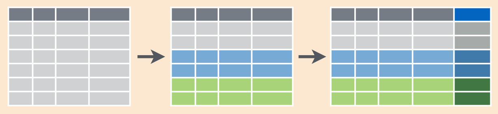

# Data manipulation: `dplyr` {#dplyr}

First, load the library:

```{r, message=FALSE}
library(tidyverse)
```

## Data

In this chapter we will use the following datasets.

### Misspelling dataset
This dataset I gathered after some manipulations with data from [The Gyllenhaal Experiment](https://pudding.cool/2019/02/gyllenhaal/) By Russell Goldenberg and Matt Daniels for [pudding](https://pudding.cool). They analysed mistakes in spellings of celebrities during the search.

```{r}
misspellings <- read_csv("https://raw.githubusercontent.com/agricolamz/DS_for_DH/master/data/misspelling_dataset.csv")
```
  

```{r}
misspellings
```

There are the following variables in this dataset:

* `correct` --- correct spelling
* `spelling` --- user's spelling
* `count` --- number of cases of user's spelling

### `diamonds`

`diamonds` --- is the dataset built-in in `tidyverse` package.

```{r}
diamonds
?diamonds
```

## `dplyr`

[Here](https://www.rstudio.com/wp-content/uploads/2015/02/data-wrangling-cheatsheet.pdf) and [here](https://github.com/rstudio/cheatsheets/raw/master/data-transformation.pdf) is a cheatsheet on dplyr.

### `filter()`


This function filter rows by some condition.

How many wrong spellings that were used by less then 10 users?

```{r}
misspellings %>%
  filter(count < 10)
```

`%>%` it is **pipe**. It allow to chain operations, puting the output of one function into the input of another:

```{r}
sort(sqrt(abs(sin(1:22))), decreasing = TRUE)
1:22 %>% 
  sin() %>% 
  abs() %>% 
  sqrt() %>% 
  sort(., decreasing = TRUE) # why do we need a dot here?
```

Pipes that are used in `tidyverse` are from the package `magrittr`. Sometimes pipe could work not well with functions outside the `tidyverse`.


### `slice()`

This function filter rows by its index.


```{r}
misspellings %>%
  slice(3:7)
```

### `select()`

This functions for choosing variables from dataframe.


```{r}
diamonds %>%
  select(8:10)

diamonds %>%
  select(color:price)

diamonds %>%
  select(-carat)

diamonds %>%
  select(-c(carat, cut, x, y, z))

diamonds %>%
  select(cut, depth, price)
```

### `arrange()`

This function order rows in dataframe (numbers --- by order, strings --- alphabeticly).

```{r}
misspellings %>%
  arrange(count)

diamonds %>%
  arrange(desc(carat), price)

diamonds %>%
  arrange(-carat, price)
```

### `distinct()`

This function retern only unique rows from an input dataframe.

```{r}
misspellings %>%
  distinct(correct)

misspellings %>%
  distinct(spelling)

diamonds %>%
  distinct(color, cut)
```

```{block, type = "rmdtask"}
In built-in dataset `starwars` filter those characters that are higher then 180 (`height`) and weigh less then 80 (`mass`). Then get a unique names of their homeworlds (`homeworld`).
```

```{r, include=FALSE}
starwars %>% 
  filter(height > 180, mass < 80) %>% 
  distinct(homeworld)
```


### `mutate()`

This functions creates new variables.


```{r}
misspellings %>%
  mutate(misspelling_length = nchar(spelling),
         id = 1:n())
```

```{block2, type = "rmdtask"}
Create a variable with body mass index [индексом Кетле](https://en.wikipedia.org/wiki/Body_mass_index):  $\frac{mass}{height^2}$ for all characters from `starwars` dataset. How many charachters have obesity (have body mass index greater 30)? (Don't forget to convert height from centimetres to metres).
```

```{r,include=FALSE}
starwars %>% 
  mutate(height = height/100,
         BMI = mass/(height^2)) %>% 
  select(name, height, mass, BMI) %>% 
  filter(BMI >= 30)
```


### `group_by(...) %>% summarise(...)`

This function allows to group variables by some columns adn get some discriptive statistics (maximum, minimum, last value, first value, mean, median etc.)


  
```{r}
misspellings %>%
  summarise(min(count), mean(count))

misspellings %>%
  group_by(correct) %>% 
  summarise(mean(count))

misspellings %>%
  group_by(correct) %>% 
  summarise(my_mean = mean(count))
```

If you need to calculate number of cases, use the function `n()` in `summarise()` or the `count()` function:

```{r}
misspellings %>%
  group_by(correct) %>% 
  summarise(n = n())


misspellings %>%
  count(correct)
```

It is even possible to srot the result, using `sort` argument:

```{r}
misspellings %>%
  count(correct, sort = TRUE)
```

In case you don't want to have any summary, but an additional column, just replace `summarise()` with `mutate()`

```{r}
misspellings %>%
  group_by(correct) %>% 
  mutate(my_mean = mean(count))
```

Here is a scheme:



```{block, type = "rmdtask"}
In the `starwars` dataset create a variable that contain mean height value for each species.
```

```{r, include=FALSE}
starwars %>% 
  group_by(species) %>% 
  mutate(mean_height = mean(height, na.rm = TRUE))
```

## Merging dataframes

### `bind_...`

This is a family of functions that make it possible to merge dataframes together:

```{r}
my_tbl <- tibble(a  = c(1, 5, 2), 
                 b = c("e", "g", "s"))
```

Here is how to merge two datasets by row:
```{r}
my_tbl %>% 
  bind_rows(my_tbl)
```

In case there is an absent column, values will be filled with `NA`:

```{r}
my_tbl %>% 
  bind_rows(my_tbl[,-1])
```

In order to merge dataframes by column you need another function:

```{r}
my_tbl %>% 
  bind_cols(my_tbl)
```

In case there is an absent row, this function will return an error:
```{r error = TRUE}
my_tbl %>% 
  bind_cols(my_tbl[-1,])
```

### `.._join()`

These functions allow to merge different datasets by some column (or columns in common).

```{r}
languages <- data_frame(
  languages = c("Selkup", "French", "Chukchi", "Polish"),
  countries = c("Russia", "France", "Russia", "Poland"),
  iso = c("sel", "fra", "ckt", "pol")
  )
languages
country_population <- data_frame(
  countries = c("Russia", "Poland", "Finland"),
  population_mln = c(143, 38, 5))
country_population
inner_join(languages, country_population)
left_join(languages, country_population)
right_join(languages, country_population)
anti_join(languages, country_population)
anti_join(country_population, languages)
full_join(country_population, languages)
```


## `tidyr` package

Here is a dataset with number of speakers of some language of India according census 2001 (data from Wikipedia):


```{r}
langs_in_india_short <- read_csv("https://raw.githubusercontent.com/agricolamz/DS_for_DH/master/data/languages_in_india.csv")
```

* Short format

```{r}
langs_in_india_short
```

* Long format

```{r, echo = FALSE}
langs_in_india_short %>% 
  pivot_longer(names_to = "type", values_to = "n_speakers", n_L1_sp:n_all_sp)->
  langs_in_india_long
langs_in_india_long
```

* Short format → Long format: `tidyr::pivot_longer()`

```{r}
langs_in_india_short %>% 
  pivot_longer(names_to = "type", values_to = "n_speakers", n_L1_sp:n_all_sp)->
  langs_in_india_long

langs_in_india_long
```

* Long format → Short format: `tidyr::pivot_wider()`

```{r}
langs_in_india_long %>% 
  pivot_wider(names_from = "type", values_from = "n_speakers")->
  langs_in_india_short
langs_in_india_short
```


```{block, type = "rmdtask"}
[Here](https://github.com/agricolamz/DS_for_DH/blob/master/data/daghestan_census.xlsx?raw=true) is data, that contain information about villages of Daghestan in `.xlsx` format. Data separated by different sheets and contain the following variables (data obtained from different sources, so they have suffixes `_s1` -- first source and `_s2` -- second source):

* `id_s1` -- (s1) identification number from first source;
* `name_1885` -- (s1) name of the village according the 1885 census
* `census_1885` -- (s1) population according the 1885 census
* `name_1895` -- (s1) name of the village according the 1895 census
* `census_1895` -- (s1) population according the 1895 census
* `name_1926` -- (s1) name of the village according the 1926 census
* `census_1926` -- (s1) population according the 1926 census
* `name_2010` -- (s1) name of the village according the 2010 census
* `census_2010` -- (s1) population according the 2010 census
* `language_s1` -- (s1) language name according the first source
* `name_s2` -- (s2) village name according the second source
* `language_s2` -- (s2) language name according the second source
* `Lat` -- (s2) latitude
* `Lon` -- (s2) longitude
* `elevation` -- (s2) altitude

First, merge all sheets fromt the `.xlsx` file:
```

```{r,  echo=FALSE, message=FALSE}
s1 <- readxl::read_xlsx("data/daghestan_census.xlsx", 1)
s2 <- readxl::read_xlsx("data/daghestan_census.xlsx", 2)
s3 <- readxl::read_xlsx("data/daghestan_census.xlsx", 3)
s4 <- readxl::read_xlsx("data/daghestan_census.xlsx", 4)
s5 <- readxl::read_xlsx("data/daghestan_census.xlsx", 5)
s6 <- readxl::read_xlsx("data/daghestan_census.xlsx", 6)

s1 %>% 
  left_join(s2) %>%
  left_join(s3) %>% 
  left_join(s4) %>% 
  left_join(s6) %>% 
  left_join(s5) %>% 
  distinct() ->
  merged
head(merged)
```

```{block, type = "rmdtask"}
Second, caclulate how many times language name is the same in both sources.
```

```{r,  include=FALSE}
merged %>% 
  count(language_s1 == language_s2)
```

```{block, type = "rmdtask"}
Third, calculate mena altitude for languages from the first source. Which is the highest?
```

```{r,  include=FALSE}
merged %>% 
  group_by(language_s1) %>% 
  summarise(m_el = mean(elevation)) %>% 
  arrange(-m_el)
```

```{block, type = "rmdtask"}
Fourth, calculate population for languages from the second source in each census.
Show the values obtained for the Lak language:
```

```{r,  echo=FALSE, message=FALSE}
merged %>% 
  group_by(language_s2) %>% 
  summarise(s_1885 <- sum(census_1885),
            s_1895 <- sum(census_1895),
            s_1926 <- sum(census_1926),
            s_2010 <- sum(census_2010))
```
