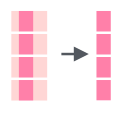

# Strings manipulation: `stringr` {#stringr}

We will use `stringr` package (in `tidyverse`) for string manipulation, so do not forget to load the `tidyverse` library.

```{r, message = FALSE}
library(tidyverse)
```

## How to create a string?

In order to create a string you need to keep an eye on quotes:
```{r}
"the quick brown fox jumps over the lazy dog"
'the quick brown fox jumps over the lazy dog'
"the quick 'brown' fox jumps over the lazy dog"
'the quick "brown" fox jumps over the lazy dog'
"the quick \"brown\" fox jumps over the lazy dog"
```

There is also an empty string (it is not the same as `NA`):
```{r}
""
''
character(3)
```

It is possible to convert something to a string:
```{r}
typeof(4:7)
as.character(4:7)
```

In this section I will show all examples using build-in datasets:
```{r}
letters
LETTERS
month.name
month.abb
```

## Merging strings

The function `str_c()` joins two or more vectors element-wise into a single character vector:
```{r}
tibble(upper = rev(LETTERS), smaller = letters) %>% 
  mutate(merge = str_c(upper, smaller))
```

It is possible to specify a string, that will be inserted between input vectors.

```{r}
tibble(upper = rev(LETTERS), smaller = letters) %>% 
  mutate(merge = str_c(upper, smaller, sep = "_"))
```

The `str_c()` function is vectorised, so it returns the number of strings that it got to the input. It is possible to merge all merged strings into one bigger string using the `collapse` argument.

```{r}
str_c(rev(LETTERS), letters, sep = "_") # results 26 strings
str_c(rev(LETTERS), letters, sep = "_", collapse = "-") # results 1 string
```

The `separate()` function turns a single character column into multiple columns using some pattern. This function has three arguments:

* `col` -- column with vectors, that should be separated
* `into` -- vector of names of new columns
* `sep` -- pattern that should be used as a separator

```{r}
tibble(mn = month.name) %>% 
  separate(col = mn, into = c("column_1", "column_2"), sep = "r")
```

## Analysing strings
In order to calculate the number of symbols in a string you can use the `str_count()` function.


```{r}
tibble(mn = month.name) %>% 
  mutate(number_charactars = str_count(mn))
```

There is an additional argument in the `str_count()` function that defines a string for counting: 


```{r}
tibble(mn = month.name) %>% 
  mutate(number_r = str_count(mn, pattern = "r"))
```

```{block, type = "rmdtask"}
There is an [article](https://pudding.cool/2019/10/pubs/) on Pudding about English pubs. [Here](https://raw.githubusercontent.com/agricolamz/DS_for_DH/master/data/UK_pubs.csv) is an aggregated dataset, that they used. Visualise the 30 most popular pub's names in UK. Visualise 40 most popular pub names in UK: number of symbols on *x* axis and number of pubs with this name on *y* axis.
```

```{r, echo=FALSE, message = FALSE, fig.height=6}
read_csv("https://raw.githubusercontent.com/agricolamz/2020.02_Naumburg_R/master/data/UK_pubs.csv") %>% 
  count(pub_name, sort = TRUE) %>% 
  mutate(nchar = str_length(pub_name)) %>% 
  slice(1:40) %>% 
  ggplot(aes(nchar, n, label = pub_name))+
  geom_point()+
  ggrepel::geom_text_repel()+
  labs(x = "number of symbols",
       y = "number of bars",
       titles = "40 most popular bar names in UK",
       caption = "data from https://pudding.cool/2019/10/pubs/")
```

There is also a useful function `str_detect()`, that returns `TRUE`, when a substring is found in a greater string, or `FALSE`, when a substring is absent.


```{r}
tibble(mn = month.name) %>% 
  mutate(is_there_r = str_detect(mn, pattern = "r"))
```

## Changing strings
### Convert case
```{r}
latin <- "tHe QuIcK BrOwN fOx JuMpS OvEr ThE lAzY dOg"
str_to_upper(latin)
str_to_lower(latin)
str_to_title(latin)
```

### Extracting a substring from a string
Extract the substring from a string: по индексам функцией `str_sub()`, и по подстроке функцией `str_extract()`.



```{r}
tibble(mn = month.name) %>% 
  mutate(mutate = str_sub(mn, start = 1, end = 2))
```

      

```{r}
tibble(mn = month.name) %>% 
  mutate(mutate = str_extract(mn, "r"))
```

By default the `str_extract()` function returns first instances of substrings. It is possible to use the `str_extract_all()` function in order to extract all instances of a substring, but the result needs to be converted to the `tibble` format.

```{r}
str_extract_all(month.name, "r", simplify = TRUE) %>% 
  as_tibble()
```

### Replacing a substring

There is a function `str_replace()`, that will replace a substring in a string with another string:


```{r}
tibble(mn = month.name) %>% 
  mutate(mutate = str_replace(mn, "r", "R"))
```

As other functions the `str_replace()` function makes only one replacement. If you need to change multiple substrings in a string you can use the `str_replace_all()` function:


```{r}
tibble(mn = month.name) %>% 
  mutate(mutate = str_replace_all(mn, "r", "R"))
```

### Removing substrings
The `str_remove()` and `str_remove_all()` functions remove matched patterns in a string.

```{r}
tibble(month.name) %>% 
  mutate(mutate = str_remove(month.name, "r"))
tibble(month.name) %>% 
  mutate(mutate = str_remove_all(month.name, "r"))
```


