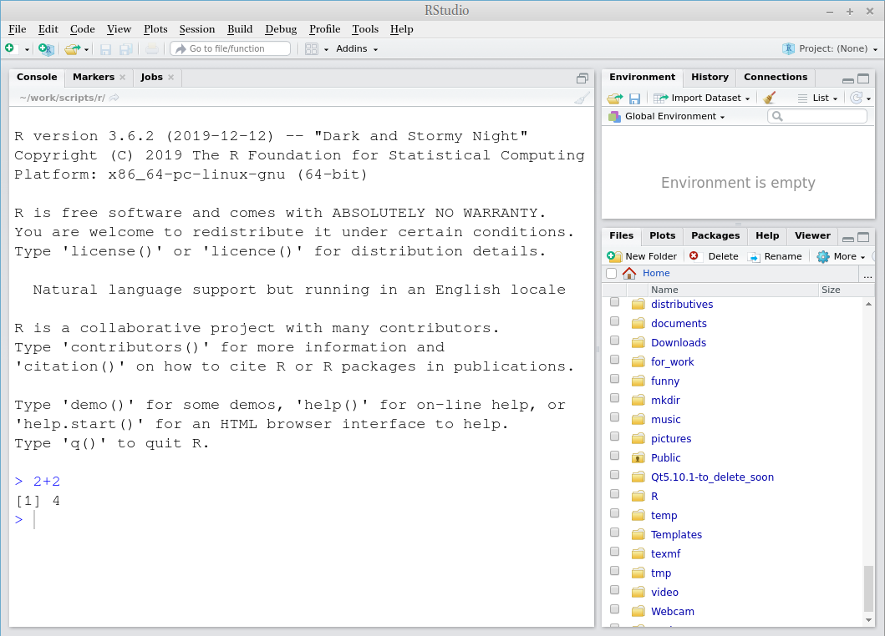
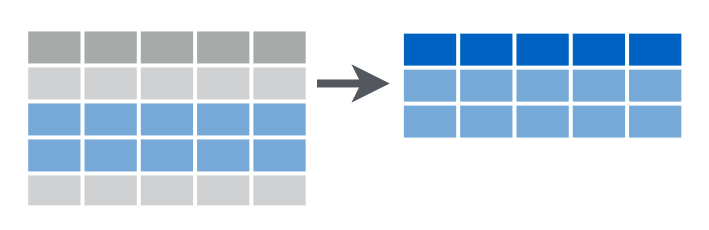
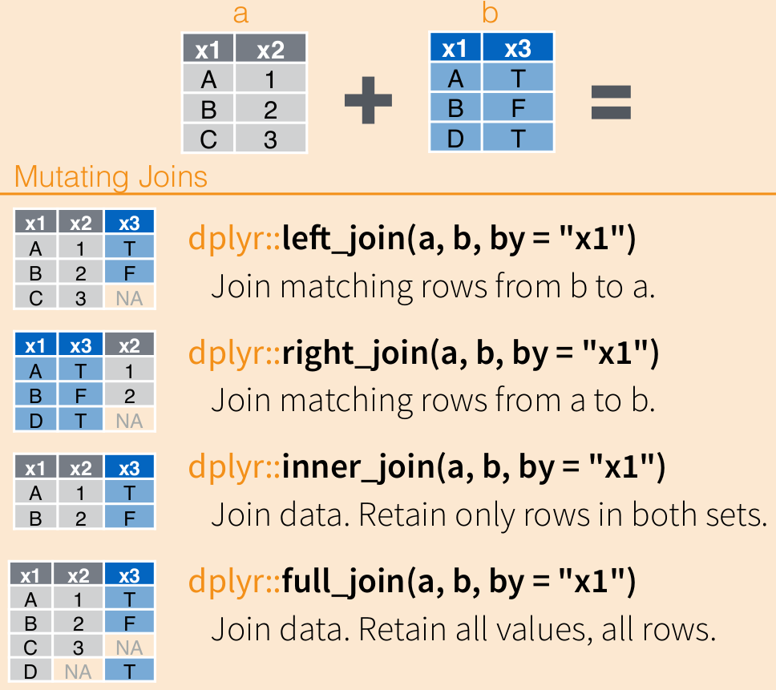
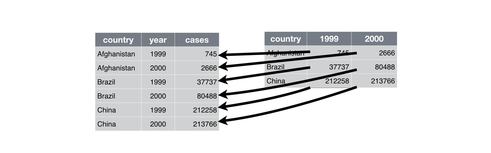
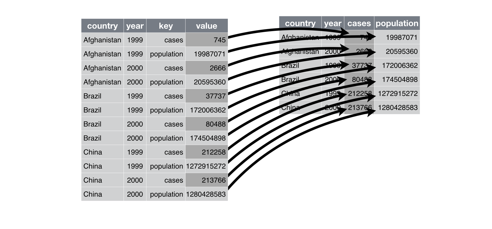

--- 
title: "Polish Language(s) and Digital Humanities Using R"
author: "G. Moroz"
date: "2020"
bibliography:
- bibliography.bib
editor_options:
  chunk_output_type: console
link-citations: yes
documentclass: book
site: bookdown::bookdown_site
biblio-style: apalike
---

# Prerequisites

Before the classes I would like to ask you to follow the instructions mentioned below to prepare your device for the class work:

* install **R** from the following link: <https://cloud.r-project.org/>
* install **RStudio** from the following link: <https://rstudio.com/products/rstudio/download/#download> (FREE version, no need to pay!)
* after the installation run the RStudio program, type `2+2`, and press `Enter`.



If you see something like this, then you are well prepared for classes.

* Go to the <https://rstudio.cloud/> website and sign up there. This is optional, but it will be a backup version, if something will not work on your computer.

Special thanks to Helena Link for the workshop orgonisation and for correcting typos in this text.

<!--chapter:end:index.Rmd-->

---
output: html_document
editor_options: 
  chunk_output_type: console
---
# Introduction to R and RStudio {#intro}

## Introduction
### Why data science?
Data science is a new field that is actively developing lately. This field merges computer science, mathematics, statistics, and it is hard to say how much science in data science. In many scientific fields a new data science paradigm arises and even forms a new sub-field:

* Bioinformatics
* Crime data analysis
* Digital humanities
* Data journalism
* Data driven medicine
* ...

There are a lot of new books "Data Science for ...":

* psychologists [@hansjoerg19]
* immunologists [@thomas19]
* business [@provost13]
* public policy [@brooks13]
* fraud detection [@baesens15]
* ...

Data scientists need to be able to:

* gather data
* transform data
* visualize data
* create a statistical model based on data
* share and represent the results of this work
* organize the whole workflow in a reproducible way

### Why R?

R [@r19] is a programming language with a big infrastructure of packages that helps to work in different fields of science and computer technology.

There are several alternatives:

* Python [@vanderplas16; @grus19]
* Julia [@bezanson17]
* bash [@janssens14]
* java [@brzustowicz17]
* ...

You can find some R answers here:

* R for data science [@wickham16], it is online
* [R community](https://community.rstudio.com/)
* [stackoverflow](https://stackoverflow.com)
* any search engine you use
* ...

## Introduction to RStudio
R is the programming language. RStudio is the most popular IDE (Integrated Development Environment) for R language.

When you open RStudio for the first time you can see something like this:


When you press  button at the top of the left window you will be able to see all four panels of RStudio.


## R as a calculator

Lets first start with the calculator. Press in R console

```{r}
2+9
50*(9-20)
3^3
9^0.5
9+0.5
9+.5
pi
```

Remainder after division

```{r}
10 %% 3
```

```{block, type = "rmdtask"}
So you are ready to solve some really hard equations (round it four decimal places):
```


$$\frac{\pi+2}{2^{3-\pi}}$$

```{r, results='asis', echo = FALSE, eval = knitr::is_html_output()}
checkdown::autocheck_question(question_id = "1_1", answer =  round((pi+2)/(2^(3-pi)), 4))
```


<details> <summary> 📋 list of hints ➡ </summary> 

<details> <summary> 👁 Are you sure that you rounded the result? ➡ </summary>
I expect the answer to be rounded to four decimal places: `0.87654321` becomes `0.8765`.<br>
</details>

<details> <summary> 👁 Are you sure you didn't get into the brackets trap? ➡ </summary>
Even though there isn't any brackets in the mathematical notation, you need to add them in R, otherwise the operation order will be wrong. <br>
</details>


</details>

## Comments

Any text after a hash `#` within the same line is considered a comment. 

```{r}
2+2 # it is four

# you can put any comments here
3+3
```


## Functions

The most important part of R is functions: here are some of them:

```{r}
sqrt(4)
abs(-5)
sin(pi/2)
cos(pi)
sum(2, 3, 9)
prod(5, 3, 9)
sin(cos(pi))
```

Each function has a name and zero or more arguments. All arguments of the function should be listed in parenthesis and separated by comma:

```{r}
pi
round(pi, 2)
```

Each function's argument has its own name and serial number. If you use names of the function's arguments, you can put them in any order. If you do not use names of the function's arguments, you should put them according the serial number.

```{r}
round(x = pi, digits = 2)
round(digits = 2, x = pi)
round(x = pi, d = 2)
round(d = 2, x = pi)
round(pi, 2)
round(2, pi) # this is not the same as all previous!
```

There are some functions without any arguments, but you still should use parenthesis:

```{r}
Sys.Date() # correct
Sys.Date # wrong
```

Each function in R is documented. You can read its documentation typing a question mark before the function name:

```{r, eval = FALSE}
?Sys.Date
```

```{block, type = "rmdtask"}
Explore the function `log()` and calculate the following logarithm:
```

$$\log_3(3486784401)$$

```{r, results='asis', echo = FALSE, eval = knitr::is_html_output()}
checkdown::autocheck_question(question_id = "1_2", answer = log(3486784401, base = 3))
```


<details> <summary> 📋 list of hints ➡ </summary> 

<details> <summary> 👁 A-a-a! I don't remember anything about logarithms... ➡</summary>
The logarithm is the inverse function to exponentiation. That means the logarithm of a given number *x* is the exponent to which another fixed number, the base *b*, must be raised, to produce that number *x*.

$$10^n = 1000,\text{ what is n?}$$
$$n = \log_{10}(1000)$$
<br>
</details>

<details> <summary> 👁 What does this small 3 in the task mean? ➡</summary>
This is the base of the logarithm. So the task is: what is the exponent to which another fixed number, the base *3*, must be raised, to produce that number *3486784401*. <br>
</details>

</details>

## Variables

Everything in R can be stored in a variable:

```{r}
x <- 5 + 6
```


As a result, no output in the Console, and a new variable *x* appear in the Environment window. From now on I can use this new variable:

```{r}
x + x
sum(x, x, 7)
```

All those operations don't change the variable value. In order to change the variable value you need to make a new assignment:

```{r}
x <- 5 + 6 + 7
```

The fast way for creating `<-` in RStudio is to press `Alt -` on your keyboard.

It is possible to use equal sign `=` for assignment operation, but the recommendations are to use arrow `<-` for the assignment, and equal sign `=` for giving arguments' value inside the functions.

For removing vector you need to use the function `rm()`:

```{r error = TRUE}
rm(x)
x
```


### Variable comparison

It is possible to compare different variables

```{r}
x <- 18
x > 18
x >= 18
x < 100
x <= 18
x == 18
x != 18
```

Operator `!` can work by itself changing logical values into reverse:

```{r}
!TRUE
!FALSE
```


### Variable types

There are several types of variables in R. In this course the only important types will be `double` (all numbers), `character` (or strings), and `logical`:

```{r}
x <- 2+3
typeof(x)
y <- "Cześć"
typeof(y)
z <- TRUE
typeof(z)
```

## Vector
An R object that contains multiple values of the same type is called **vector**. It could be created with the command `c()`:

```{r}
c(3, 0, pi, 23.4, -53)
c("Kraków", "Warszawa", "Cieszyn")
c(FALSE, FALSE, TRUE)

a <- c(2, 3, 4)
b <- c(5, 6, 7)
c(a, b)
```

For the number sequences there is an easy way:

```{r}
1:10
3:-5
```

From now on you can understand that everything we have seen before is a vector of length one. That is why there is `[1]` in all outputs: it is just an index of elements in a vector. Have a look here:

```{r}
1:60
60:1
```

There is also a function `seq()` for creation of arithmetic progressions:

```{r}
1:20
seq(from = 1, to = 20, by = 1)
seq(from = 2, to = 100, by = 13)
```


```{block, type = "rmdtask"}
Use the argument `length.out` of function `seq()` and create an arithmetic sequence from $\pi$ to $2\pi$ of length 50.

```

```{r, include=FALSE}
seq(pi, 2*pi, length.out = 50)
```

There are also some built-in vectors:

```{r}
letters
LETTERS
month.name
month.abb
```

### Vector coercion
Vectors are R objects that contain multiple values of **the same type**. But what if we merged together different types?

```{r}
c(1, "34")
c(1, TRUE)
c(TRUE, "34")
```

It is clear that there is a hierarchy: strings > double > logical. It is not universal across different programming languages. It doesn't correspond to the amount of values of particular type:

```{r}
c(1, 2, 3, "34")
c(1, TRUE, FALSE, FALSE)
```

The same story could happen during other operations:

```{r}
5+TRUE
```

### Vector operations

All operations, that we discussed earlier, could be done with vectors of the same length:

```{r}
1:5 + 6:10
1:5 - 6:10
1:5 * 6:10
```

There are operations where the vector of any length and vector of length one is involved:

```{r}
1:5 + 7
1:5 - 7
1:5 / 7
```

There are a lot of functions in R that are **vectorised**. That means that applying this function to a vector is the same as applying this function to each element of the vector:

```{r}
sin(1:5)
sqrt(1:5)
abs(-5:3)
```

### Indexing vectors

How to get some value or banch of values from a vector? You need to index them:

```{r}
x <- c(3, 0, pi, 23.4, -53)
y <- c("Kraków", "Warszawa", "Cieszyn")

x[4]
y[2]
```

It is possible to have a vector as index:

```{r}
x[1:2]
y[c(1, 3)]
```

It is possible to index something that you **do not** want to see in the result:
```{r}
y[-2]
x[-c(1, 4)]
```

It is possible to have other variables as an index

```{r}
z <- c(3, 2)
x[z]
y[z]
```

It is possible to index with a logical vector:

```{r}
x[c(TRUE, FALSE, TRUE, TRUE, FALSE)]
```

That means that we could use `TRUE/FALSE`-vector produced by comparison:

```{r}
x[x > 2]
```

It works because `x > 2` is a vector of logical values:

```{r}
x > 2
```


It is possible to use `!` operator here changing all `TRUE` values to `FALSE` and vice versa.

```{r}
x[!(x > 2)]
```


```{block, type = "rmdtask"}
How many elements in the vector `g` if expression `g[pi < 1000]` does not return an error?
```

### `NA`

Sometimes there are some missing values in the data, so it is represented with `NA`
```{r}
NA
c(1, NA, 9)
c("Kraków", NA, "Cieszyn")
c(TRUE, FALSE, NA)
```

It is possible to check, whether there are missing values or not

```{r}
x <- c("Kraków", NA, "Cieszyn")
y <- c("Kraków", "Warszawa", "Cieszyn")
is.na(x)
is.na(y)
```

Some functions doesn't work with vecotors that contain missed values, so you need to add argument `na.rm = TRUE`:


```{r}
x <- c(1, NA, 9, 5)
mean(x)
mean(x, na.rm = TRUE)
min(x, na.rm = TRUE)
max(x, na.rm = TRUE)
median(x, na.rm = TRUE)
range(x, na.rm = TRUE)
```


## Packages

The most important and useful part of R is hidden in its packages. Everything that we discussed so far is basic R functionality invented back in 1979. Since then a lot of different things changed, so all new practices for data analysis, visualisation and manipulation are packed in packages. During our class we will learn the most popular *"dialect"* of R called `tidyverse`.

In order to install packages you need to use a command. Let's install the `tidyverse` package:

```{r, eval=FALSE}
install.packages("tidyverse")
```

For today we also will need the `readxl` package:

```{r, eval=FALSE}
install.packages("readxl")
```

After you have downloaded packages nothing will change. You can not use any fucntionality from packages unless you load the package with the `library()` function:

```{r}
library("tidyverse")
```

Not loading a package is the most popular mistake of my students. So remember:

* `install.packages("...")` is like you are buying a screwdriver set;
* `library("...")` is like you are starting to use your screwdriver.


For the further lectures we will need `tidyverse` package.

```{block, type = "rmdtask"}
Please install `tidyverse` package and load it.
```


### `tidyverse`

The [`tidyverse`](https://blog.rstudio.org/2016/09/15/tidyverse-1-0-0/) is a set of packages:

* `tibble`, for tibbles, a modern re-imagining of data frames --- analogue of tables in R
* `readr`, for data import
* `dplyr`, for data manipulation
* `tidyr`, for data tidying (we will discuss it later today)
* `ggplot2`, for data visualisation
* `purrr`, for functional programming

## Dataframe (tibble)


A data frame is a collection of variables of the same number of rows with unique row names. Here is an example dataframe with the Tomm Moore filmography:

```{r}
moore_filmography <- tibble(title = c("The Secret of Kells", 
                                      "Song of the Sea", 
                                      "Kahlil Gibran's The Prophet", 
                                      "The Breadwinner", 
                                      "Wolfwalkers"),
                            year = c(2009, 2014, 2014, 2017, 2020),
                            director = c(TRUE, TRUE, TRUE, FALSE, TRUE))
moore_filmography
```

There are a lot of built-in dataframes:

```{r, eval = knitr::is_html_output()}
mtcars
iris
```
  
You can find information about them:

```{r, eval = FALSE}
?mtcars
?iris
```

Dataframe consists of vectors that could be called using `$` sign:

```{r}
moore_filmography$year
moore_filmography$title
```

It is possible to add a vector to an existing dataframe:

```{r}
moore_filmography$producer <- c(TRUE, TRUE, FALSE, TRUE, TRUE)
moore_filmography
```

There are some useful functions that tell you somethig about a dataframe:

```{r}
nrow(moore_filmography)
ncol(moore_filmography)
summary(moore_filmography)
str(moore_filmography)
```

We will work exclusively with dataframes. But it is not the only data structure in R.


```{block, type = "rmdtask"}
How many rows are in the `iris` dataframe?
```

```{r, results='asis', echo = FALSE, eval = knitr::is_html_output()}
checkdown::autocheck_question(question_id = "1_3", answer =  nrow(iris))
```

```{block, type = "rmdtask"}
How many columns are in the `mtcars` dataframe?
```

```{r, results='asis', echo = FALSE, eval = knitr::is_html_output()}
checkdown::autocheck_question(question_id = "1_4", answer =  ncol(mtcars))
```

### Indexing dataframes

Since dataframes are two-dimensional objects it is possible to index its rows and columns. Rows are the first index, columns are the second index:

```{r}
moore_filmography[3, 2]
moore_filmography[3,]
moore_filmography[,2]
moore_filmography[,1:2]
moore_filmography[,-3]
moore_filmography[,-c(1:2)]
moore_filmography[,"year"]
moore_filmography[,c("title", "year")]
moore_filmography[moore_filmography$year > 2014,]
```

## Data import

### `.csv` files

A `.csv`  files (comma-separated values) is a delimited text file that uses a comma (or other delemeters such as tabulation or semicolon) to separate values. It is broadly used bacause it is possible to parse such a file using computers and people can edit it in the Office programs (Microsoft Excel, LibreOffice Calc, Numbers on Mac). Here is our `moore_filmography` dataset in the `.csv` format:

```
title,year,director,producer
The Secret of Kells,2009,TRUE,TRUE
Song of the Sea,2014,TRUE,TRUE
Kahlil Gibran's The Prophet,2014,TRUE,FALSE
The Breadwinner,2017,FALSE,TRUE
Wolfwalkers,2020,TRUE,TRUE
```

Let's create a variable with this file:

```{r}
our_csv <- "title,year,director,producer
The Secret of Kells,2009,TRUE,TRUE
Song of the Sea,2014,TRUE,TRUE
Kahlil Gibran's The Prophet,2014,TRUE,FALSE
The Breadwinner,2017,FALSE,TRUE
Wolfwalkers,2020,TRUE,TRUE"
```

Now we are ready to use `read_csv()` function:

```{r}
read_csv(our_csv)
```


It is also possible to read files from your computer. Download [this](https://raw.githubusercontent.com/agricolamz/2020.02_Naumburg_R/master/data/moore_filmography.csv) file on your computer (press `Ctrl S` or `Cmd S`) and read into R:

```{r, eval=FALSE}
read_csv("C:/path/to/your/file/moore_filmography.csv")
```

```{r, echo=FALSE}
read_csv(our_csv)
```


It is also possible to read files from the Internet:

```{r}

read_csv("https://raw.githubusercontent.com/agricolamz/2020.02_Naumburg_R/master/data/moore_filmography.csv")
```

```{block, type = "rmdtask"}
Because of the 2019–20 Wuhan coronavirus outbreak the city of Wuhan is on media everywhere. [In Russian](https://nplus1.ru/blog/2020/02/03/wuhan) for some reason Wuhan is sometimes masculine and sometimes it is feminin. I looked into other Slavic languages and recorded obtained data into the [`.csv` file](https://gist.githubusercontent.com/agricolamz/c280527d6b5d79693b85d8fcf8d35bc3/raw/c46a32a218bc5d6933703ae677b81ff5a4a1dcaa/wuhan.csv). Download this files to R. What variables does it have?
```

All file manipulations in R are somehow connected with space on your computer via working directory. You can get information about your current working directory using `getwd()` function. You can change your working directory using `setwd()` function. If a file you want to read is in the working directory you don't need to write the whole path to file:

```{r, eval = FALSE}
read_csv("moore_filmography.csv")
```

The same simple function will create your `.csv` file:

```{r, eval = FALSE}
write_csv(moore_filmography, "moore_filmography_v2.csv")
```


Sometimes reading `.csv` files into Microsoft Excel is complicated, please follow the [following instructions](https://www.thewindowsclub.com/how-to-convert-a-text-txt-csv-file-into-an-excel-file).

### `.xls` and `.xlsx` files


There is a package `readxl` that allows to open and save `.xsl` and `.xslx` files. Install and load the package:


```{r}
library(readxl)
```

Here is a [test file](https://github.com/agricolamz/2020.02_Naumburg_R/raw/master/data/moore_filmography.xlsx). Download it to your computer and put it to your working directory:


```{r, eval= FALSE}
read_xlsx("moore_filmography.xlsx")
```
```{r, echo=FALSE}
read_xlsx("data/moore_filmography.xlsx")
```

`.xls` and `.xlsx` files could have multiple tables on different sheets:


```{r, eval=FALSE}
read_xlsx("moore_filmography.xlsx", sheet = "iris")
```

```{r, echo=FALSE}
read_xlsx("data/moore_filmography.xlsx", sheet = "iris")
```

## Rmarkdown

If you press `Ctrl S` or `Cmd S` then you will save your script. There is also another useful type of coding in R: `rmarkown`. First install this package:


```{r, eval=FALSE}
install.packages("rmarkdown")
```


Then it will be possible to create a new file: `File > New File > R Markdown...`.


Press `OK` in the following menu and you will get the template of your R Markdown file. You can modify it, then press  and the result file will be created in your working directory. `rmarkdown` package is a really popular and well developed package that creates output into:


* markdown
* html
* docx
* pdf
* beamer presentation
* pptx presentation
* epub
* ...
* multiple templates for different scientific journals (package `rticsles` and `papaja`)
* ...

<!--chapter:end:01-intro.Rmd-->

---
output: html_document
editor_options: 
  chunk_output_type: console
---
# Data manipulation: `dplyr` {#dplyr}

First, load the library:

```{r, message=FALSE}
library(tidyverse)
```

## Data

In this chapter we will use the following datasets.

### Misspelling dataset
I gathered this dataset after some manipulations with data from [The Gyllenhaal Experiment](https://pudding.cool/2019/02/gyllenhaal/) by Russell Goldenberg and Matt Daniels for [pudding](https://pudding.cool). They analized mistakes in spellings of celebrities during the searching process.

```{r}
misspellings <- read_csv("https://raw.githubusercontent.com/agricolamz/2020.02_Naumburg_R/master/data/misspelling_dataset.csv")
```
  

```{r}
misspellings
```

There are the following variables in this dataset:

* `correct` --- correct spelling
* `spelling` --- user's spelling
* `count` --- number of cases of user's spelling

### `diamonds`

`diamonds` --- is the dataset built-in in the `tidyverse` package.

```{r}
diamonds
?diamonds
```

## `dplyr`

[Here](https://www.rstudio.com/wp-content/uploads/2015/02/data-wrangling-cheatsheet.pdf) and [here](https://github.com/rstudio/cheatsheets/raw/master/data-transformation.pdf) is a cheatsheet on dplyr.

### `filter()`



This function filters rows under some conditions.

How many wrong spellings were used by less then 10 users?

```{r}
misspellings %>%
  filter(count < 10)
```

`%>%` it is **pipe** (hot key is `Ctrl Shift M`). It allows to chain operations, putting the output of one function into the input of another:

```{r}
sort(sqrt(abs(sin(1:22))), decreasing = TRUE)
1:22 %>% 
  sin() %>% 
  abs() %>% 
  sqrt() %>% 
  sort(., decreasing = TRUE) # why do we need a dot here?
```

Pipes that are used in `tidyverse` are from the package `magrittr`. Sometimes pipe could work not well with functions outside the `tidyverse`.


So `filter()` function returns rows with matching conditions:

```{r}
misspellings %>%
  filter(count < 10)
```

It is possible to use multiple conditions. How many wrong spellings of `Deschanel` were used by less then 10 users?

```{r}
misspellings %>%
  filter(count < 10,
         correct == "deschanel")
```

It is possible to use OR conditions. How many wrong spellings were used by less then 10 OR more then 500 users?

```{r}
misspellings %>%
  filter(count < 10 |
           count > 500)
```

### `slice()`

This function filters rows by its index.


```{r}
misspellings %>%
  slice(3:7)
```

### `select()`

This functions for choosing variables from a dataframe.


```{r}
diamonds %>%
  select(8:10)

diamonds %>%
  select(color:price)

diamonds %>%
  select(-carat)

diamonds %>%
  select(-c(carat, cut, x, y, z))

diamonds %>%
  select(cut, depth, price)
```

### `arrange()`

This function orders rows in a dataframe (numbers --- by order, strings --- alphabetically).

```{r}
misspellings %>%
  arrange(count)

diamonds %>%
  arrange(desc(carat), price)

diamonds %>%
  arrange(-carat, price)
```

### `distinct()`

This function returns only unique rows from an input dataframe.

```{r}
misspellings %>%
  distinct(correct)

misspellings %>%
  distinct(spelling)

diamonds %>%
  distinct(color, cut)
```

```{block, type = "rmdtask"}
In built-in dataset `starwars` filter those characters that are higher then 180 (`height`) and weigh less then 80 (`mass`). How many unique names of their homeworlds (`homeworld`) is there?
```

```{r, results='asis', echo = FALSE, eval = knitr::is_html_output()}
starwars %>% 
  filter(height > 180, mass < 80) %>% 
  distinct(homeworld) %>% 
  nrow() ->
  answer
  
checkdown::autocheck_question(question_id = "2_1", answer =  answer)
```


### `mutate()`

This function creates new variables.


```{r}
misspellings %>%
  mutate(misspelling_length = nchar(spelling),
         id = 1:n())
```

```{block2, type = "rmdtask"}
Create a variable with body mass index [Body mass index](https://en.wikipedia.org/wiki/Body_mass_index):  $\frac{mass}{height^2}$ for all characters from `starwars` dataset. How many charachters have obesity (have body mass index greater 30)? (Don't forget to convert height from centimetres to metres).
```

```{r, results='asis', echo = FALSE, eval = knitr::is_html_output()}
starwars %>% 
  mutate(height = height/100,
         BMI = mass/(height^2)) %>% 
  select(name, height, mass, BMI) %>% 
  filter(BMI >= 20)
  nrow() ->
  answer
  
checkdown::autocheck_question(question_id = "2_2", answer =  answer)
```

### `group_by(...) %>% summarise(...)`

This function allows to group variables by some columns and get some descriptive statistics (maximum, minimum, last value, first value, mean, median etc.)


  
```{r}
misspellings %>%
  summarise(min(count), mean(count))

misspellings %>%
  group_by(correct) %>% 
  summarise(mean(count))

misspellings %>%
  group_by(correct) %>% 
  summarise(my_mean = mean(count))
```

If you need to calculate number of cases, use the function `n()` in `summarise()` or the `count()` function:

```{r}
misspellings %>%
  group_by(correct) %>% 
  summarise(n = n())


misspellings %>%
  count(correct)
```

It is even possible to sort the result, using `sort` argument:

```{r}
misspellings %>%
  count(correct, sort = TRUE)
```

In case you don't want to have any summary, but an additional column, just replace `summarise()` with `mutate()`

```{r}
misspellings %>%
  group_by(correct) %>% 
  mutate(my_mean = mean(count))
```

Here is a scheme:


```{block, type = "rmdtask"}
In the `starwars` dataset create a variable that contains mean height value for each species.
```

```{r, include=FALSE}
starwars %>% 
  group_by(species) %>% 
  mutate(mean_height = mean(height, na.rm = TRUE))
```

## Merging dataframes

### `bind_...`

This is a family of functions that make it possible to merge dataframes together:

```{r}
my_tbl <- tibble(a  = c(1, 5, 2), 
                 b = c("e", "g", "s"))
```

Here is how to merge two datasets by row:
```{r}
my_tbl %>% 
  bind_rows(my_tbl)
```

In case there is an absent column, values will be filled with `NA`:

```{r}
my_tbl %>% 
  bind_rows(my_tbl[,-1])
```

In order to merge dataframes by column you need another function:

```{r}
my_tbl %>% 
  bind_cols(my_tbl)
```

In case there is an absent row, this function will return an error:
```{r error = TRUE}
my_tbl %>% 
  bind_cols(my_tbl[-1,])
```

### `.._join()`

These functions allow to merge different datasets by some column (or columns in common).

```{r}
languages <- data_frame(
  languages = c("Selkup", "French", "Chukchi", "Polish"),
  countries = c("Russia", "France", "Russia", "Poland"),
  iso = c("sel", "fra", "ckt", "pol")
  )
languages
country_population <- data_frame(
  countries = c("Russia", "Poland", "Finland"),
  population_mln = c(143, 38, 5))
country_population
inner_join(languages, country_population)
left_join(languages, country_population)
right_join(languages, country_population)
anti_join(languages, country_population)
anti_join(country_population, languages)
full_join(country_population, languages)
```



## `tidyr` package

Here is a dataset with the number of speakers of some language of India according the census 2001 (data from Wikipedia):


```{r}
langs_in_india_short <- read_csv("https://raw.githubusercontent.com/agricolamz/2020.02_Naumburg_R/master/data/languages_in_india.csv")
```

* Wide format

```{r}
langs_in_india_short
```

* Long format

```{r, echo = FALSE}
langs_in_india_short %>% 
  pivot_longer(names_to = "type", values_to = "n_speakers", n_L1_sp:n_all_sp)->
  langs_in_india_long
langs_in_india_long
```

* Wide format → Long format: `tidyr::pivot_longer()`



```{r}
langs_in_india_short %>% 
  pivot_longer(names_to = "type", values_to = "n_speakers", n_L1_sp:n_all_sp)->
  langs_in_india_long

langs_in_india_long
```

* Long format → Wide format: `tidyr::pivot_wider()`



```{r}
langs_in_india_long %>% 
  pivot_wider(names_from = "type", values_from = "n_speakers")->
  langs_in_india_short
langs_in_india_short
```

### Tidy data

You can represent the same underlying data in multiple ways. The whole `tidyverse` phylosophy built upon the tidy datasets, that are datasets where:

* Each variable must have its own column.
* Each observation must have its own row.
* Each value must have its own cell.

```{block, type = "rmdtask"}
[Here](https://github.com/agricolamz/2020.02_Naumburg_R/raw/master/data/daghestan_census.xlsx) is data, that contains information about villages of Daghestan in `.xlsx` format. The data is separated by different sheets and contains the following variables (data obtained from different sources, so they have suffixes `_s1` -- first source and `_s2` -- second source):

* `id_s1` -- (s1) identification number from first source;
* `name_1885` -- (s1) name of the village according the 1885 census
* `census_1885` -- (s1) population according the 1885 census
* `name_1895` -- (s1) name of the village according the 1895 census
* `census_1895` -- (s1) population according the 1895 census
* `name_1926` -- (s1) name of the village according the 1926 census
* `census_1926` -- (s1) population according the 1926 census
* `name_2010` -- (s1) name of the village according the 2010 census
* `census_2010` -- (s1) population according the 2010 census
* `language_s1` -- (s1) language name according the first source
* `name_s2` -- (s2) village name according the second source
* `language_s2` -- (s2) language name according the second source
* `Lat` -- (s2) latitude
* `Lon` -- (s2) longitude
* `elevation` -- (s2) altitude

First, merge all sheets fromt the `.xlsx` file:
```

```{r,  echo=FALSE, message=FALSE}
s1 <- readxl::read_xlsx("data/daghestan_census.xlsx", 1)
s2 <- readxl::read_xlsx("data/daghestan_census.xlsx", 2)
s3 <- readxl::read_xlsx("data/daghestan_census.xlsx", 3)
s4 <- readxl::read_xlsx("data/daghestan_census.xlsx", 4)
s5 <- readxl::read_xlsx("data/daghestan_census.xlsx", 5)
s6 <- readxl::read_xlsx("data/daghestan_census.xlsx", 6)

s1 %>% 
  left_join(s2) %>%
  left_join(s3) %>% 
  left_join(s4) %>% 
  left_join(s6) %>% 
  left_join(s5) %>% 
  distinct() ->
  merged
head(merged)
```

```{block, type = "rmdtask"}
Second, caclulate how many times the language name is the same in both sources.
```

```{r, results='asis', echo = FALSE, eval = knitr::is_html_output()}
merged %>% 
  count(language_s1 == language_s2) %>% 
  slice(2) %>% 
  select(n) %>% 
  unlist() ->
  answer
  
checkdown::autocheck_question(question_id = "2_3", answer =  answer)
```

```{block, type = "rmdtask"}
Third, calculate mean altitude for languages from the first source. Which is the highest?
```

```{r, results='asis', echo = FALSE, eval = knitr::is_html_output()}
merged %>% 
  group_by(language_s1) %>% 
  summarise(m_el = mean(elevation)) %>% 
  arrange(-m_el) %>% 
  head(1) %>% 
  select(m_el) %>% 
  unlist() ->
  answer
  
checkdown::autocheck_question(question_id = "2_4", answer =  answer)
```

```{block, type = "rmdtask"}
Fourth, calculate the population for languages from the second source in each census.
Show the values obtained for the Lak language:
```

```{r,  echo=FALSE, message=FALSE}
merged %>% 
  group_by(language_s2) %>%  
  summarise(s_1885 <- sum(census_1885),
            s_1895 <- sum(census_1895),
            s_1926 <- sum(census_1926),
            s_2010 <- sum(census_2010)) %>% 
  filter(language_s2 == "Lak")
```

<!--chapter:end:02-dplyr-tidyr.Rmd-->

---
output: html_document
editor_options: 
  chunk_output_type: console
---
# Data visualisation: `ggplot2` {#ggplot2}

```{r, include=FALSE}
knitr::opts_chunk$set(echo = TRUE, message = FALSE, warning = FALSE)
```

```{r}
library("tidyverse")
```

## Why visualising data?
### The Anscombe’s Quartet
In Anscombe, F. J. (1973). "Graphs in Statistical Analysis" there was the following dataset:

```{r}
quartet <- read_csv("https://raw.githubusercontent.com/agricolamz/2020.02_Naumburg_R/master/data/anscombe.csv")
quartet
quartet %>% 
  group_by(dataset) %>% 
  summarise(mean_X = mean(x),
            mean_Y = mean(y),
            sd_X = sd(x),
            sd_Y = sd(y),
            cor = cor(x, y),
            n_obs = n()) %>% 
  select(-dataset) %>% 
  round(2)
```

Lets visualise those datasets:

```{r, echo = FALSE}
quartet %>% 
  ggplot(aes(x, y))+
  geom_point()+
  geom_smooth(method = "lm", se = F)+
  facet_wrap(~dataset)+
  theme_bw()
```

### The DataSaurus
In [Matejka and Fitzmaurice (2017) "Same Stats, Different Graphs"](https://www.autodeskresearch.com/sites/default/files/SameStats-DifferentGraphs.pdf) there are the following datasets:

```{r}
datasaurus <- read_csv("https://raw.githubusercontent.com/agricolamz/2020.02_Naumburg_R/master/data/datasaurus.csv")
datasaurus
```

```{r, echo=FALSE}
datasaurus %>% 
  ggplot(aes(x, y))+
  geom_point()+
  facet_wrap(~dataset)+
  theme_bw()
```

And... all discriptive statistics are the same!

```{r}
datasaurus %>% 
  group_by(dataset) %>% 
  summarise(mean_X = mean(x),
            mean_Y = mean(y),
            sd_X = sd(x),
            sd_Y = sd(y),
            cor = cor(x, y),
            n_obs = n()) %>% 
  select(-dataset) %>% 
  round(1)
```

## Basic `ggplot2`

`ggplot2` is a modern tool for data visualisation. There are [a lot of extentions](http://www.ggplot2-exts.org/gallery/) for `ggplot2`. There is also [a cheatsheet on `ggplot2`](https://github.com/rstudio/cheatsheets/raw/master/data-visualization-2.1.pdf). There is also a whole book about `ggplot2` [@wickham16].

Every `ggplot2` plot has three key components:

* data,
* A set of aesthetic mappings between variables in the data and visual properties, and
* At least one layer which describes how to render each observation. Layers
are usually created with a `geom_...()` function.

### Scaterplot

I downloaded a Polish dictionary from [here](https://sjp.pl/slownik/odmiany/). I removed all abbreviations and proper names and took only one form from the paradigm. After all this I calculated the number of syllables (simply by counting vowels, combinations of *i* and other vowels I counted as one), number of symbols in each word and extracted the first letter. Here is the [result dataset](https://raw.githubusercontent.com/agricolamz/2020.02_Naumburg_R/master/data/polish_dictionary.csv).

```{block, type = "rmdtask"}
Download this dataset to the variable `polish_dictionary`. How many words are there?
```

```{r, include=FALSE}
polish_dictionary <- read_csv("https://raw.githubusercontent.com/agricolamz/2020.02_Naumburg_R/master/data/polish_dictionary.csv")
```

```{r, results='asis', echo = FALSE, eval = knitr::is_html_output()}
checkdown::autocheck_question(question_id = "3_1", answer =  nrow(polish_dictionary))
```

So this data could be visualised using the following code:

* `ggplot2`
```{r, eval = FALSE}
ggplot(data = polish_dictionary, aes(x = n_char, y = n_vowels)) +
  geom_point()
```

* `dplyr` and `ggplot2`
```{r first_ggplot, cache=TRUE}
polish_dictionary %>%
  ggplot(aes(x = n_char, y = n_vowels))+
  geom_point()
```

#### Layers

All commands in `ggplot2` are separated by `+` sign (author of the package, Hadley Wickham, [is deeply regrets that it is not `%>%`](https://www.youtube.com/watch?v=vYwXMnC03I4)), but their order matters:

```{r layers_1, cache=TRUE}
polish_dictionary %>%
  ggplot(aes(n_char, n_vowels))+
  geom_point()+
  geom_smooth()
```

```{r layers_2, cache=TRUE}
polish_dictionary %>%
  ggplot(aes(n_char, n_vowels))+
  geom_smooth()+
  geom_point()
```

#### `aes()`

Since every `ggplot2` plot has data as a key components there is a function `aes()` that maps variables from dataframe onto visual properties of the graph. There is a simple rule:

**If values are from dataframe put them into `aes()`, otherwise --- don't.**

```{r aes_1, cache=TRUE}
polish_dictionary %>%
  ggplot(aes(n_char, n_vowels, color = first_letter))+
  geom_point()
```

```{r aes_2, cache=TRUE}
polish_dictionary %>%
  ggplot(aes(n_char, n_vowels))+
  geom_point(color = "green")
```

```{r, cache=TRUE}
polish_dictionary %>%
  ggplot(aes(n_char, n_vowels))+
  geom_point(aes(color = first_letter))
```

There are some other possibilities to mark categories:

* with `shape` argument

```{r shape, cache=TRUE}
polish_dictionary %>%
  filter(first_letter == "a" |
           first_letter == "i" |
           first_letter == "u") %>% 
  ggplot(aes(n_char, n_vowels, shape = first_letter))+
  geom_point()
```

* with `label` argument and `geom_text()`

```{r label, cache=TRUE}
polish_dictionary %>%
  filter(first_letter == "a" |
           first_letter == "i" |
           first_letter == "u") %>% 
  ggplot(aes(n_char, n_vowels, label = first_letter))+
  geom_text()
```

* with `opacity` argument

```{r}
polish_dictionary %>%
  filter(first_letter == "a" |
           first_letter == "i" |
           first_letter == "u") %>% 
  ggplot(aes(n_char, n_vowels))+
  geom_point(alpha = 0.1)
```


Sometimes annotations overlap:
```{r}
polish_dictionary %>%
  slice(8400:8450) %>%  # lets pick 50 words from our dictionary
  ggplot(aes(n_char, n_vowels, label = word))+
  geom_text()
```

Then it is better to use `geom_text_repel()` from the `ggrepel` library (do not forget to download it using `install.packages("ggrepel")`):
```{r}
library("ggrepel")
polish_dictionary %>%
  slice(8400:8450) %>% 
  ggplot(aes(n_char, n_vowels, label = word))+
  geom_text_repel()
```

It looks better, when you add some points:

```{r}
polish_dictionary %>%
  slice(8400:8450) %>% 
  ggplot(aes(n_char, n_vowels, label = word))+
  geom_text_repel()+
  geom_point()
```

#### Annotate labels, axis, caption etc.

```{r}
polish_dictionary %>%
  slice(8400:8450) %>% 
  ggplot(aes(n_char, n_vowels, label = word))+
  geom_text_repel()+
  geom_point()+
  labs(x = "number of characters",
       y = "number of vowels",
       title = "Correlation of number of characters and vowels",
       subtitle = "data from sjp.pl",
       caption = "this graph is created with ggplot2")
```

```{block, type = "rmdtask"}
Download [this dataset](https://raw.githubusercontent.com/agricolamz/DS_for_DH/master/data/first_scatterplot.csv) and create a scatterplot. What is there?
```

```{r, results='asis', echo = FALSE, eval = knitr::is_html_output()}
checkdown::autocheck_question(question_id = "3_2", answer =  "DH")
```

### Barplots

The same data can be aggregated and non-aggregated:

```{r}
misspelling <- read_csv("https://raw.githubusercontent.com/agricolamz/DS_for_DH/master/data/misspelling_dataset.csv")
misspelling
```

* variable `spelling` is **aggregated**: for each value of `speeling` variable there is a corresponging value in `count` variable.
* variable `correct` is **non-aggregated**: there is no any variable associated with counts of `correct` variable

In order to create a bar plot from aggregated data you need to use `geom_col()`:
```{r}
misspelling %>% 
  slice(1:20) %>% 
  ggplot(aes(spelling, count))+
  geom_col()
```

Lets flip axes:
```{r}
misspelling %>% 
  slice(1:20) %>% 
  ggplot(aes(spelling, count))+
  geom_col()+
  coord_flip()
```

In order to create a bar plot from aggregated data you need to use `geom_bar()`:

```{r}
misspelling %>% 
  ggplot(aes(correct))+
  geom_bar()
```

Lets flip axes:
```{r}
misspelling %>% 
  ggplot(aes(correct))+
  geom_bar()+
  coord_flip()
```

Non-aggregated data could be transform into aggregated
```{r}
misspelling %>% 
  count(correct)
```

Aggregated data could be transform into non-aggregated
```{r, eval = knitr::is_html_output()}
misspelling %>% 
  uncount(count)
```

#### Factors

All variables in the previous section are ordered alphabetically. In order to create your own orders we need to look at factors:

```{r}
my_factor <- factor(misspelling$correct)
head(my_factor)
levels(my_factor)
levels(my_factor) <- rev(levels(my_factor))
head(my_factor)

misspelling %>% 
  mutate(correct = factor(correct, levels = c("deschanel",
                                              "galifianakis",
                                              "johansson",
                                              "kaepernick",
                                              "labeouf",
                                              "macaulay",
                                              "mcgwire",
                                              "mclachlan",
                                              "minaj",
                                              "morissette",
                                              "palahniuk",
                                              "picabo",
                                              "poehler",
                                              "shyamalan",
                                              "mcconaughey"))) %>% 
  ggplot(aes(correct))+
  geom_bar()+
  coord_flip()
```

There is a package `forcats` for factors (it in `tidyverse`, [here is a cheatsheet](https://github.com/rstudio/cheatsheets/raw/master/factors.pdf)). There are a lot of useful functions in `forcats`, but the one I use the most is the `fct_reorder()` function:

```{r}
misspelling %>% 
  count(correct)

misspelling %>% 
  count(correct) %>% 
  ggplot(aes(fct_reorder(correct, n), n))+
  geom_col()+
  coord_flip()
```

```{block, type = "rmdtask"}
There is an [article](https://pudding.cool/2019/10/pubs/) on Pudding about English pubs. [Here](https://raw.githubusercontent.com/agricolamz/DS_for_DH/master/data/UK_pubs.csv) is an aggregated dataset, that they used. Visualise the 30 most popular pub's names in Great Britain. 
```

```{r, echo=FALSE, message = FALSE}
read_csv("https://raw.githubusercontent.com/agricolamz/DS_for_DH/master/data/UK_pubs.csv") %>% 
  count(pub_name, sort = TRUE) %>% 
  mutate(pub_name = reorder(pub_name, n)) %>% 
  slice(1:30) %>% 
  ggplot(aes(pub_name, n, label = n))+
  geom_col()+
  geom_text(nudge_y = 10)+
  coord_flip()+
  labs(x = "", y = "", caption = "data from https://pudding.cool/2019/10/pubs/")
```

<details> <summary> 📋 list of hints ➡ </summary> 

<details> <summary> 👁 How to get this counts? ➡ </summary>
Use the `count` function. <br>
</details>

<details> <summary> 👁 Why there are so many values? ➡ </summary>
In the task I asked you to take only 30 of them. May be you need the `slice()` function in order to do it. <br>
</details> 

<details> <summary> 👁 Why there are pubs with count 1 on my graph?. ➡ </summary>
By default the `count` function does not sort anything, so you get only pubs with frequency 1 from the `slice()` function. In order to sort your values you need to use the `arrange()` function or use an additional `sort = TRUE` argument in the `count()` function. <br>
</details> 

<details> <summary> 👁 It looks like I've finished. ➡ </summary>
Have you removed your x and y axes' annotation? Have you added the caption?
<br>
</details>
</details>


## Faceting


Faceting -- is a really powerfull tool for data exploration. This function splits visualisations into subplots using some variable.

```{r, fig.width=9, fig.height=12}
misspelling %>% 
  filter(count > 500) %>% 
  ggplot(aes(fct_reorder(spelling, count), count))+
  geom_col()+
  coord_flip()
misspelling %>% 
  filter(count > 500) %>% 
  ggplot(aes(fct_reorder(spelling, count), count))+
  geom_col()+
  coord_flip()+
  facet_wrap(~correct)
```

By default `facet_wrap()` creates the same scale for all facets. This could be changed by argument `scales`:

```{r, fig.width=9, fig.height=12}
misspelling %>% 
  filter(count > 500) %>% 
  ggplot(aes(fct_reorder(spelling, count), count))+
  geom_col()+
  coord_flip()+
  facet_wrap(~correct, scales = "free")
```

It is also possible to add multiple variables:

```{r facet_wrap, fig.width=9, fig.height=12, cache=TRUE}
diamonds %>% 
  ggplot(aes(carat, price))+
  geom_point(size = 0.3)+
  facet_wrap(~color+cut, scales = "free")
```

There is a way to make it more compact using the `facet_grid()` function instead of the `facet_wrap()` function:

```{r facet_grid, fig.width=9, fig.height=12, cache=TRUE}
diamonds %>% 
  ggplot(aes(carat, price))+
  geom_point(size = 0.3)+
  facet_grid(cut~color, scales = "free")
```

It is also possible to create a marginal summary with the `margins` argument of the `facet_grid()` function :

```{r facet_margins, fig.width=9, fig.height=12, cache=TRUE}
diamonds %>% 
  ggplot(aes(carat, price))+
  geom_point(size = 0.3)+
  facet_grid(cut~color, scales = "free", margins = TRUE)
```

```{block, type = "rmdtask"}
Use the `polish_dictionary` and reproduce the following graph.
```

```{r polish_facet, cache = TRUE, echo=FALSE, fig.width=9, fig.height=12}
polish_dictionary %>% 
  ggplot(aes(n_char, n_vowels))+
  geom_point(alpha = 0.1)+
  facet_wrap(~first_letter)+
  labs(x = "number of characters",
       y = "number of vowels",
       caption = "data from sjp.pl")
```


<!--chapter:end:03-ggplot2.Rmd-->

# Strings manipulation: `stringr` {#stringr}


<!--chapter:end:04-stringr.Rmd-->

# Text manipulation: `gutenbergr`, `tidytext`, `udpipe` {#texts}


<!--chapter:end:05-gutenbergr-tidytext-udpipe.Rmd-->

# Stylometric analysis: `stylo` {#stylo}


<!--chapter:end:06-stylo.Rmd-->

`r if (knitr::is_html_output()) '
# References {-}
'`

<!--chapter:end:07-references.Rmd-->

